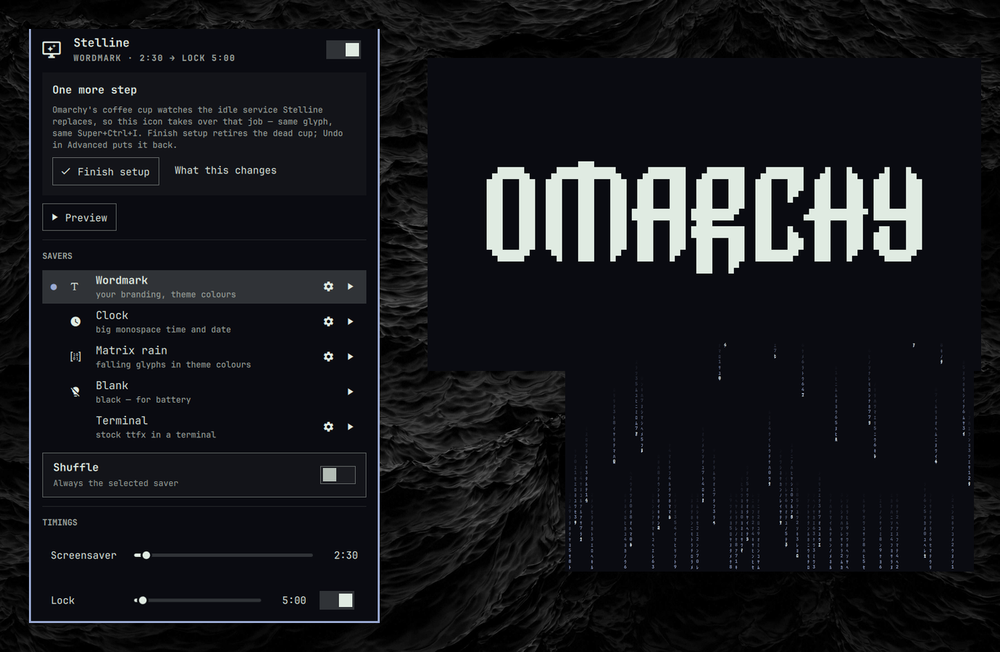

# Stelline

A native screensaver manager for [Omarchy](https://omarchy.org) 4 (Quattro).

Stelline keeps Omarchy's own screensaver as the default and adds to it — your
branding redrawn in the theme's colours, a clock, nothing at all, or
**your own**: whatever you copied, pictures, a folder of them, a video clip,
some text, or a description, turned into ASCII art in your theme's colours (or
shown as they are). Every tile is an instance of a type anyone can add, and on
top of any of them sit **widgets** — a clock, what arrived while you were away,
whether your coding agent is waiting — in a corner or in the middle. A grid of
tiles, one click to choose, and a rule per tile — at night, on battery, with a
theme, docked — for when each one plays. Until you choose otherwise, what plays
is the stock screensaver, untouched.



It replaces Omarchy's built-in idle service (`omarchy.idle`) the sanctioned
way — the manifest declares it a clone — and keeps the stock timeline verbatim:
`idle.screensaver` and `idle.lock` in `shell.json`, the lock, wake, inhibitors,
Stay awake (`Super+Ctrl+I`), `omarchy toggle screensaver`, and dismissing the
saver cancelling a pending lock. Removing the plugin puts the built-in back.

Pure QML. No installer, no sudo, no services, nothing outside the plugin
directory except what the panel tells you it writes.

## Why

Omarchy's screensaver is a terminal emulator running `ttfx`. It only exits on a
keypress inside its own terminal, saturates several cores on HiDPI, renders
behind pinned windows, races on multi-monitor setups, and there is no way to
keep the screensaver but skip the lock. Stelline is a layer-shell surface on
every monitor: any key, click, wheel or deliberate pointer movement dismisses
it, it sits above pinned windows, it costs a few percent of a core, and each
stage has its own switch.

## Install

```sh
omarchy plugin add https://github.com/aashbury/stelline.git --enable
omarchy restart shell
```

The restart is needed once: the shell loads the new service before it lets go
of the stock one, and until then `omarchy-shell idle status` still answers
from the stock service. The panel offers a **Restart shell** button while that
is the case.

Then click the new icon in the bar and press **Finish setup**. Omarchy's
coffee-cup indicator watches the stock idle service, so under Stelline it can
never light up or respond; Finish setup removes it from the indicators list
(remembering what was there) and Stelline's own icon takes over the job — same
glyph, same hotkey. **Put the old one back**, under Shortcuts, restores the list exactly.

Requires Omarchy 4.x. Stelline's id is `io.github.aashbury.stelline`.

## Use

The panel is ordered by how often you touch a thing: the master switch and
**Stay awake** at the top, then the timings, then the gallery, then the one
row you set once (Shortcuts) collapsed to one line. It opens at the top with nothing unfolded, every time. Rows are plain:
a glyph, a label, a switch — the only boxes are the one open detail card and
the Add card, and nothing carries a sentence of explanation, the way Omarchy's
own panels don't. A gallery past four rows keeps four and ends in a **Show
all** tile.

| Where | Action | Effect |
|---|---|---|
| bar icon | left-click | open the panel |
| bar icon | right-click | toggle Stay awake (the coffee cup) |
| bar icon | middle-click | preview the current saver |
| panel | click a tile | make it the usual saver (with Shuffle on: check it in) |
| panel | ⚙ on a tile | the same three blocks on every tile: **WHEN … PLAYS** (its rule), **LOOK** (the knobs of its type), **ON TOP** (its widgets), and Delete; for the Original, the artwork instead of widgets. ▶ and ⚙ appear while the pointer or the keyboard cursor is on a tile |
| panel | click another tile while a ⚙ panel is open | the panel follows to that tile |
| panel | **Different timings on battery**, **Never lock while docked** | laptops only; each is an ordinary rule underneath |
| panel | 󰅶 Stay awake | the coffee cup — top of the panel, same as Super+Ctrl+I |
| panel | ▶ on a tile | preview it |
| panel | the **Add** tile | a new saver of any kind: *Describe it*, *Words*, *Pictures*, *A clip*, *Clock* or *Blank*, each with only the settings it needs; pasting a picture or a clip picks the kind for you |
| saver | any key, click, wheel or pointer movement | dismiss |
| saver | `→` or `n` | next saver in the rotation |

Keyboard in the panel: `h`/`j`/`k`/`l` or arrows move (through the grid too),
`Enter` activates, `h`/`l` also step a slider, `p` previews the tile under the
cursor, `g` opens it, `n` adds, `s` toggles Shuffle, `x` deletes (twice),
`Esc` closes. Fields inside
editors take the mouse.

A hotkey, if you want one, goes in `~/.config/hypr/bindings.lua`:

```lua
o.bind("SUPER + CTRL + S", "Screensaver", "omarchy-shell stelline preview")
```

Shortcuts can also point *System › Screensaver* (`Super+Esc`) at
Stelline. That edits `~/.config/omarchy/extensions/omarchy-menu.jsonc` by
inserting two marked lines before the final brace; it refuses to touch a file
that does not parse, and the toggle removes exactly those lines again.

## Savers

| | |
|---|---|
| **Original** | Omarchy's own screensaver, exactly as it ships and the default: `ttfx` in your terminal, cycling through its 37 effects at random. Choose a subset in ⚙ — with a choice, Stelline starts the terminal itself running a copy of Omarchy's loop with `--include-effects`; without, it runs the stock launcher untouched. Its ⚙ also has the same three artwork edits as *Style › Screensaver* (a picture, the text, back to the logo). |
| **Wordmark** | A word you type — **Text** in its ⚙, `stelline` to begin with — drawn by Stelline instead of `ttfx`, in the same four tones of dots as the figures — `stelline` itself is hand-drawn (`art/wordmark.js`: slanted capitals, lit tops, a shaded extrusion, scanlines, a ruled line), and any other word gets the same treatment from ImageMagick — with one of **eighteen animations of Stelline's own** every few seconds — `decrypt`, `rain`, `beams`, `scatter`, `wipe`, `typewriter`, `reveal`, `pulse`, and six that assemble the art rather than fade it in: `scanline` (a bright bar sweeps down), `grid` (a lattice snaps in, then fills), `shockwave` (an expanding ring), `slit` (opens from one column and widens), `glitch` (bands tear sideways and lock back), `dust` (particles drift in and converge), `spotlight` (a beam crosses and leaves the letters lit behind it), `cascade` (columns fall and each drops a letter as its head goes by), `derez` (diagonal shards slide in from alternating sides), `collapse` (spun in from far out and tightened onto the letterform), `storm` (rain in the dark, the sky going off behind it). Five of them animate the **whole canvas** rather than the letters alone — a beam crossing the dark, rain falling past the word, a ring expanding through the emptiness — the way Omarchy's own effects use the whole terminal. They are not Omarchy's 37 — those run only inside `ttfx`, so only the Original has them. What you get instead is the cost: almost nothing, against several cores. Clear the field and it shows Omarchy's shared artwork instead, the same file the Original plays. |
| **Clock** | An empty screen with the clock widget in the middle: seven-segment digits built from block characters, the colon blinking in the accent, the date in small wide-tracked capitals beneath. Repaints only when the text changes. *Add › Clock* makes another. |
| **Blank** | An empty screen, black. Exists so a battery rule has somewhere free to point, and for whatever you put on top of it. *Add › Blank* makes another. |

Every one of these but the Original is an ordinary instance of a type — text,
empty — with its defaults in the settings and nothing special of its own.
Delete any of them; Add makes the same thing again.

It is a screensaver, so it never settles into a picture. Every cycle is
**arrive → live → depart**: an animation brings the art in, something quiet
rolls over it while it rests — a bright band scanning down, a couple of rows
tearing sideways, a brief scramble — and then it goes again, falling, shearing
off, wound into the middle, dissolving, or swept away. The next arrival lands
a few pixels off the last, which is the burn-in drift too. **Rest between** is
how long the live stretch lasts: four seconds by default, `0` for never still.

Animations are drawn as light rather than as characters: each frame carries a
brightness per cell, and the renderer lays out one text layer per level — a
bright core, the body, and a falloff — which is what makes a sweep read as a
beam. Layers with nothing in them are never laid out.

An effect may draw outside the word: the frame carries a margin all round and
coordinates stay in the word's own frame of reference, so `spotlight` sweeps
its beam across empty space and `cascade` rains past the letters rather than
only on them. Each brightness is emitted at its own left edge and shifted back
by the renderer, so a narrow beam lays out narrow text.

A full cycle costs about a third of one core while it is on screen and nothing
when it is not — full-canvas animation is most of that. Omarchy's own
screensaver costs several whole cores. **On battery the whole-canvas effects
stand down** on their own, the way a series halves its frame rate; if you want
less still, the **Calm** mood has none of them, **Rest between** trades motion
for quiet, and a battery rule can point at **Blank**.

Colours are the theme's, never invented: settled art in the foreground colour,
the glyphs still in flight in the accent, and `pulse` breathing between the
two. Plenty of Omarchy themes set the accent *to* the foreground, which would
leave the motion one flat colour — on those the muted tone stands in, so an
animation always reads as an animation. The font is the shell's monospace font.

**A saver's settings follow its type**, so two savers of the same type are
configured the same way whether they shipped with Stelline or you made them,
and every ⚙ has the same three blocks. **LOOK** holds the type's knobs: a
**text** saver — the built-in Wordmark, or anything the Add card set in big letters —
has a **Text** field and Stelline's animations; **pictures** get a fit and a
crossfade; **art** gets the animations and a dwell; an **animation** gets a
frame rate; an **empty** screen has only its background; the **Original** has
Omarchy's effects and the artwork. Nothing is hardcoded; the built-in wordmark
is simply defaulted to `stelline` so there is something to look at on day one.

**ON TOP** holds the widgets, the same three on every tile: a **clock**, the
**notifications** that arrived since you went idle, and your **coding
agents**, as a small figure acting out what they are doing. Each is a switch,
and when it is on you say where it goes by clicking a
little picture of the screen: four corners and the middle, where a widget is
drawn large. The agent also picks its figure from the figures themselves,
side by side and at work, the chosen one lit. Two widgets in the same spot stack. A clock in the middle of an
empty screen is the Clock tile; the agent in the middle of an empty screen is
a status board. The Original is Omarchy's own window and carries none.

**Which animations play** is one control in a saver's ⚙, for Stelline's
fourteen and Omarchy's thirty-seven alike: **Everything**, or a mood —
**Calm** (quiet reveals), **Neon** (decode and CRT), **Kinetic** (motion and
particles). A mood is just a set of effects, so *Choose individually* under it
opens the full list and ticking your own is still there; the moods together
are exactly the whole list, and nothing extra is stored either way.

### Your own

The **Add** tile is one card: a field, and whatever you attach to it. What
gets made follows from what is there, and the card asks only the one
question that is left open:

| On the card | Becomes |
|---|---|
| **Words** | ASCII art drawn by your **default coding agent** (`omarchy default agent` — Claude Code, Codex, Gemini, OpenCode, Copilot, Crush, Pi, Oh My Pi or Grok), each in its one-shot mode with tools off or read-only where it has such a switch; Claude Code if no default is set; the Claude API with `ANTHROPIC_API_KEY` as a last resort. *Make it* an animation loop, a still, or **big letters** — block art of the words themselves, a wordmark of your own. With no agent about, words are big letters. |
| **One picture** — pasted (a screenshot, a file, a folder copied in the file manager; Ctrl+V or the Paste button, which appears the moment the clipboard holds one), or picked with *Pictures or a clip…* | a dot matrix of the whole picture, exactly as the card's preview shows it — nothing is cropped and no agent is asked — or the picture as it is. Both ways are shown on the card before you choose. **Motion**: *animated* or *still* (a dot matrix lights up or breathes; a picture pushes in slowly or holds). |
| **Several pictures** — paste or pick more onto the card; each shows as a thumbnail you can take off | one piece each, the same two ways and the same **Motion**, plus **Order**: *shuffled* (the default) or *in order*, a new one every 12 seconds |
| **A folder** (*A folder…*) | the same, and a folder shown as-is is read live: drop a picture in, it joins |
| **A clip** — a video or a GIF on its own | an ASCII animation, frame by frame (the first 20 s at 10 fps) — or the clip as it is, as an animated picture |
| **Words and a picture** | a prompt: your agent draws from the picture — up to four of them — the way the words ask, as *an animation* or *a still*. Needs an agent that can be handed a picture (Claude Code, Codex, Gemini, or the Claude API); with any other, the words name the saver and the picture is converted as it is. An agent redraws rather than copies, so for a true likeness leave the words empty. |
| *a clock* · *an empty screen* (the quiet line at the right) | an empty screen with the clock widget in the middle, the same as the shipped Clock; or an empty screen in the theme's background, for whatever you put on top |

### Moving, or a still

Both are the same dot matrix; only the saver's own effect setting differs,
so either can be changed afterwards from the tile's settings.

**Moving** is the LED sign: the dots light up across the art under one of
eighteen effects, then rest — never still, because a band of light keeps
rolling through them (`scan`) or a slow swell travels across on the
diagonal with a few dots catching it early and burning bright (`shimmer`).
Then they go out and light up again a different way. Nothing deforms and
nothing is re-converted: the likeness is quantised once, and after that the
dots only switch on and off. *Each piece stays* sets how long the rest
lasts before it goes again.

Only those two play over a dot matrix. The other two ambients swap in
cipher glyphs or ghost a shifted copy, which reads as damage over braille
rather than as light.

A piece of its own is drawn at about three quarters of the screen rather
than the smaller frame a wordmark gets, keeping its own proportions: a tall
subject fills the height, a wide one the width.

Everything Stelline draws is made of the same dots. A braille cell holds
two across and four down, and that is the grid the block characters are
drawn on too — so a photograph, a word in big letters, the clock's digits,
whatever an agent draws, and the little figure in the corner are all one
material rather than some of them being solid slabs. Art too small for a
dot to survive, a tile thumbnail or the figure at its smallest, falls back
to solid geometry, which reads better and costs one rectangle instead of
eight circles.

A still is painted cell by cell, so the blocks become dots as they are
drawn. An animation is swapped frame by frame as plain text — repainting a
canvas every frame costs three times as much — so there the blocks are
swapped for the braille cell holding the same dots, once when the frames
load. The art keeps its size and anything that is not a block is left
alone, so a clip that was already braille passes through untouched.

Those proportions need one correction, and it is easy to miss. A braille
dot is not square: two of them span a cell's width and four its height, and
a monospace cell is roughly 0.46 as wide as it is tall, so a dot ends up
about a tenth taller than it is wide. Converted straight onto that grid, a
picture comes out stretched upward by the same tenth. So every picture is
widened by that much before the transcoder samples it, and the shell
measures the ratio from the font the theme actually uses rather than
assuming one. Block art halves the same way and takes the same correction.

**A still** shows every dot at once and lets the colour breathe between the
foreground and the accent, six seconds out and back. It never departs.

Create is the only step. The tile opens below the grid as it lands, with
**Preview** beside Delete, and the tile's name can be changed by clicking it.
A described saver keeps its words there: edit them and **Change it** sends
the drawing you have back with the new words, so "taller" or "add rain"
works as a follow-up; **Draw it again** starts over from the words alone.
While it works, **Stop** ends it and leaves the tile to be asked again.

Every request carries the same standing rules as its system prompt (what
the art is for, the ░▒▓█ tone ramp and when braille earns its place, one
column per character, seamless loops with identical still parts), with
Claude Code and the API taking them as such and the other agents reading
them first. Put your own rules in `~/.config/omarchy/stelline/style.md` and
they go under the standing ones on every request: a palette of characters,
a subject to avoid, the look of the place.

The grid is sized per request rather than fixed, because resolution and
frame count trade against each other — the whole answer has to arrive in
one reply. Asking for detail, realism, proportion or a likeness buys room
by spending frames:

| Asked for | Grid | Frames |
|---|---|---|
| a still | 120 × 36 | 1 |
| a still, detailed | 160 × 46 | 1 |
| an animation | 80 × 28 | 10 |
| an animation, detailed | 120 × 38 | 6 |

With a picture attached, the picture is converted to that grid first and
handed over as the starting point, so the proportions come from the
transcoder rather than the model's memory. That also means **any** agent can work from a picture, including
the ones that cannot open a file.

One honest limit: an agent redraws, it does not copy. For a true likeness
of a photograph, attach the picture with no words at all — then it goes
through the transcoder untouched, at full braille resolution, which is far
more faithful than anything a model draws. The card says so when you ask an
agent for a likeness.

The transcoder is made for logos on transparency; a screenshot or a
photograph is flattened first, and a dark one inverted, so it does not come
out as a solid block. When an agent says which way round the tones run, that
answer is used instead of guessing from the average brightness — which is
what fools it on a dark subject in a bright scene.

Imports run in the background — the tile appears at once and fills in; a
notification says when it is ready — one after another. ASCII conversion is
Omarchy's own `omarchy-transcode-ascii` (braille for pictures, block for text),
frames come from `ffmpeg`, letters from ImageMagick; all of them ship with
Omarchy. Line art, logos and silhouettes convert well; busy photographs are
better shown as they are. The transcoder is made for logos on transparency;
a screenshot or a photograph is flattened first, and a dark one inverted, so
it does not come out as a solid block. A pasted picture is copied into the
saver, so it outlives the session.

Each saver is a folder under `~/.config/omarchy/stelline/savers/<id>/` holding
a `saver.json` and its pieces — `001.txt`, `002.txt`… for ASCII pieces, a
`frames.txt` with frames separated by form feeds for an animation, `clip.gif`
for a clip, or nothing but paths for pictures shown as they are. A folder is a
self-contained bundle: copy it to another machine, it works there; edit the
text by hand, it shows. Delete in ⚙ removes the folder and every rule and
setting that named it; pictures shown as-is are never touched.

```json
{ "name": "Acme Co.", "kind": "ascii", "pieces": ["001.txt", "002.txt"], "play": "slideshow",
  "source": { "type": "images", "paths": ["/home/you/Pictures/logo.svg", "…"] } }
```

`kind` is `ascii`, `image` or `empty`; `play` is `slideshow` or `animation`
(with `fps`); `folder` instead of `pieces` means "every picture in that folder,
live". The per-saver knobs — dwell, speed, effects, order, fit, motion,
background, the widgets — live with the plugin's other settings, not in the
folder.

## Timings and stages

The sliders write `idle.screensaver` and `idle.lock` in
`~/.config/omarchy/shell.json` — the same keys the stock service reads, so
nothing forks. Both are seconds from the moment you went idle. The sliders
always show those settings; the line under the title says what is in effect
right now, rules included (*blank after 3:00, no lock · docked*). The lock switch
is Stelline's own: off keeps the screensaver and never locks on idle (the stock
service cannot do that). The switch at the top of the panel *is* Omarchy's own
screensaver toggle — the same flag as *Trigger › Toggle › Screensaver* and
`omarchy toggle screensaver` — so the two never disagree: off means no idle
screensaver, lock left alone, previews still work, as in stock.

## When a saver plays

Click a tile: that is the usual saver, the one that plays when nothing else
applies. A tile's ⚙ is the one place a saver's rule is edited. Under **WHEN
<SAVER> PLAYS** are four switches — at night, on battery, docked, with a
theme; all the ones that are on have to hold, and each shows its own fields
once it is on. **Different timings at those times** adds the same two sliders
as at the top of the panel, for while the rule holds; the lock slider's own
switch is *never lock*.

| Condition | Holds when |
|---|---|
| At night | the clock is inside a window, wrapping midnight |
| On battery | unplugged, optionally only below a percentage |
| Docked | an external monitor is one of the active outputs — the laptop's own panel does not count, and whether the lid is open or closed makes no difference. Nothing to set. |
| With a theme | `~/.local/state/omarchy/current/theme.name` equals the chosen slug |

A rule that changes only the timings has no tile, so it lives under the
sliders, and on a laptop there are two: **Different timings on battery**
(on, it unfolds its own screensaver and lock sliders, starting shorter) and
**Never lock while docked** (on, the screensaver plays for as long as you are
away and a nudge of the mouse is straight back in; the lock returns the
moment the monitor is unplugged). Whether the lid closing sends the machine
to sleep is logind's decision, not the screensaver's — see
`HandleLidSwitchExternalPower` in `logind.conf(5)`.

Every rule that fits applies at once: the saver comes from the first rule
that names one, each timing from the first rule that sets it, and *never
lock* beats any number another rule sets. So a clip for the evenings and a
set of company logos for the working day is two tiles — give the clip a night
rule from 17:00 to 08:30 and click the logos — and the battery timings still
apply when the clip is playing. Nothing in the package is anyone's content:
the built-ins draw your own branding file, the clock, or nothing; every other
saver is one you made. Nothing ships enabled, so a fresh install behaves
exactly like stock. Unknown condition types never match, so a rule written
by a newer version is inert on an older one.

## Widgets

What sits on top of a saver, set per tile under **ON TOP**. The **clock** is
the seven-segment face, small in a corner or large in the middle, with the
time written both ways to pick from, and date and seconds as check boxes.
**Notifications** is a quiet card: how many arrived since you went idle, from
which apps (counts by default; summaries or bodies are opt-in — it is an
unattended screen).

The **coding agent** is a figure that acts out what your agents are doing,
drawn in the theme's foreground with its lights in the accent. It types while
one works, keys lighting under its fingers; takes its hands off the keys,
under a blinking beacon, when one needs you; stays at the keys in the rain
when it has finished and is waiting for you; crosses and throws sparks when
one hit an error; and goes dark, pulsing slowly, when there is nothing.
Three figures come with it — **Hands**, a pair of prosthetic hands at a
keyboard; **Robot**, a visored android, head and shoulders, with code running
across its visor while it works; and **Morty**, a red-and-white Boston
terrier drawn from a photograph of the dog himself, grinning when he is
waiting on you — and the choice is the tile's own. All three are drawn the
same way: as vector cels in `art/` (four tones — lit, dense, sparse and
black — with an ink line wherever one form passes in front of another), then
baked by `node tools/bake.js` onto a grid of 120 × 160 dots, which is written
to `savers/RobotArt.js`. The figure lays the baked poses down, moves them,
and does the light. Every card holds its figure in the same three-by-four
frame, with the words under it, so the card is the same shape whichever
figure it shows.

Soft tone everywhere was tried first, on the grounds that it would match a
converted photograph. It does not work at this size: a photograph has real
detail to carry it and a small figure does not, so everything merged into
one grey mass and the hands stopped reading as hands. The line-work is what
makes them legible.

They are animated like sprites too, rather than being a picture with an
effect on it. Every state is a loop of six to sixteen frames, and under
whatever the state is named after there is always something smaller going
on: the chest rising and falling, an ear turning, a finger twitching, a
blink about one frame in eight. The tables that drive those are separate
from the tables that drive the main movement, so the two drift against each
other and the loop does not read as a short repeat.

The grid can be made finer again without the widget growing: the figure's
size is worked out from how many rows it has. Under it, which agent and what it is on, and a
line for every other session, so the one that is stuck is never hidden behind
the one that is busy. Large in the middle of an empty screen it is a status
board. Claude Code is read exactly, from the registry it keeps of its own
running sessions (`~/.claude/sessions/`, honouring `CLAUDE_CONFIG_DIR`):
its status, what it is waiting for, and the session's title from the
transcript. Every other agent Omarchy knows — Codex, Gemini, OpenCode,
Copilot, Crush, Pi, Oh My Pi, Grok — is a running process, and whether it has
done anything in the last few seconds says working or waiting for you. The
probe runs every few seconds while a saver is up and the widget is on, and
never otherwise; nothing here talks to an agent. Unlike the notifications, it
does not hide under Do Not Disturb: it is status, not an interruption. Widgets sharing a spot stack, clock first; the cards hide while Do Not
Disturb is on and when there is nothing to say, and show on the focused
monitor only. Notifications
are read from Omarchy's own mirror under `~/.local/state/omarchy/notifications/`;
nothing here talks to the notification daemon. A tile with no widget settings
of its own uses the old global `card` settings as its defaults, so an upgrade
changes nothing.

## Settings

Everything lives inline on the plugin's entry in `shell.json`, Omarchy-style.
The panel writes it; `omarchy-shell stelline get <key>` reads it. Scalars can be
set with `omarchy-shell stelline set <key> <json>`; anything with a comma has to
be base64 (Quickshell's IPC splits arguments on commas):

```sh
omarchy-shell stelline set saver '"clock"'
omarchy-shell stelline set64 shuffleFrom "$(printf '["clock","blank"]' | base64 -w0)"
```

Defaults:

```json
{ "saver": "terminal", "shuffle": false, "shuffleFrom": ["wordmark", "clock"],
  "screensaverEnabled": true, "lockEnabled": true,
  "savers": { "wordmark": { "text": "stelline", "effect": "cycle", "effects": [], "holdSec": 4, "background": "theme" },
              "clock": { "background": "theme", "widgets": { "clock": { "on": true, "place": "centre" } } },
              "blank": { "background": "black" }, "terminal": { "effects": [] } },
  "hidden": [], "situations": [],
  "card": { "enabled": true, "corner": "bottom-right", "detail": "counts", "showAgent": true, "maxApps": 4 },
  "describe": { "model": "", "effort": "medium" },
  "integration": { "menuEntry": false } }
```

`describe` is how a described saver is drawn: `model` names one for the
agent (`claude -p --model`, `codex -m`, `gemini -m`, or the API's model;
empty means the agent's own default, or Opus 5 on the API) and `effort` is
`low`, `medium` or `high` where the agent takes it. Low answers in about
half a minute; high may take minutes and is stopped after ten.

A saver's knobs sit under `savers.<id>`: `text`, `play`, `dwellSec`, `fps`,
`effects`, `order` (`sequence`/`shuffle`), `fit` (`contain`/`cover`), `motion`
(`none`/`zoom`), `background`, and `widgets` — `clock` (`on`, `place`,
`format`, `showDate`, `showSeconds`), `notifications` (`on`, `place`,
`detail` `counts`/`summaries`/`bodies`), `agent` (`on`, `place`, `figure`
`deck`/`visor`). A `place`
is `top-left`, `top-right`, `bottom-left`, `bottom-right` or `centre`;
anything else (including the older `corner`) means the tile's `corner`, which
in turn defaults to the `card` below. `effects` empty means all of them.
`hidden` lists shipped tiles that were deleted. `card` is only the widgets'
default now.

## IPC

`omarchy-shell stelline <method>`: `status`, `preview [saver]`, `show`, `hide`,
`next`, `mini [saver]` / `hideMini` (a small corner preview that takes no
focus), `list`, `get`, `set`, `set64`, `setSaver`, `toggleShuffle`,
`setStage <screensaver|lock> <on|off>`, `setTimeout <stage> <seconds>`,
`toggleStayAwake`, `setRule <saver> <night|battery|theme> <on|off>`,
`import64 <base64 json>` (the spec the Add card builds: `source`
`images|folder|video|text|prompt`, `paths` (with `prompt`: the pictures the
words start from), `text`, `prompt`, `style` `ascii|image`, `name`, `fps`,
`seconds`, `animated`, `frames`, `retryOf <id>` to draw under an existing
tile), `retry <id>`, `stop <id>`, `rename64 <id> <base64 name>`,
`describe64 <id> <base64 json>` (`words`, `animated`), `deleteSaver <id>`,
`rescan`, `beginAdd`, `pick <media|folder|images|video>`, `paste`,
`cancelAdd`, `finishSetup`, `undoSetup`,
`setMenuEntry <on|off>`, `branding <image|text|reset>` (the artwork edits),
`simulateIdle`, `simulateLock [dry-run|off|real]`,
`reloadCard`, `ping`.

```sh
omarchy-shell stelline import64 "$(printf '%s' '{"source":"text","text":"Acme Co.","style":"ascii"}' | base64 -w0)"
```

`omarchy-shell idle status|enable|disable|toggle` keep working exactly as with
the stock service; `status` reports `"clone": "stelline"`.

## Known limits

- *Style › Screensaver* edits still open the stock terminal preview afterwards
  (`omarchy-branding-screensaver` calls the launcher itself). The art shows
  up in Stelline's Wordmark live; use the panel's Preview to see it.
- Fields inside editors are mouse-driven; rows and tiles are keyboard-navigable.
- Converting a clip to ASCII runs the stock transcoder once per frame: about a
  minute for 20 seconds of video. It runs in the background.
- An agent reads only inside its own working directory, so pictures handed
  to one are copied into a scratch folder first and it is run from there.
- A described saver needs a default coding agent (`omarchy default agent`),
  Claude Code, or `ANTHROPIC_API_KEY`; without one, words on the Add card are
  big letters, and the card names who it will ask when there is someone. The
  agent is asked at low effort where it takes that switch (at the default a
  model deliberates over the grid spec for minutes; `describe.effort` picks
  it); an animation usually takes under a minute at low, a few at high. The
  art is read between marker lines the prompt asks
  for, so an agent's own chatter cannot end up in a frame, and every frame is
  laid on the grid of the largest so the picture holds still. What comes back
  is only as good as the model's drawing that day.
- An Add in progress lives in the shell's memory: a shell restart while the
  file chooser is up loses the card, not the pictures.
- Pinned-effect terminal launching on more than one monitor follows the stock
  launcher's sequence but has only been tested on one.
- Disabling the plugin leaves a harmless `{ "id": "omarchy.idle" }` entry in the
  bar layout (Omarchy writes it when restoring a clone; it renders nothing).
  `omarchy plugin enable` turns it back into Stelline's entry; after a real
  uninstall remove it by hand if you like:
  `jq 'del(.bar.layout[][] | select(type=="object" and .id=="omarchy.idle"))' ~/.config/omarchy/shell.json | sponge ~/.config/omarchy/shell.json`

## Uninstall

```sh
# in the panel: Shortcuts › Put the old one back   (or: omarchy-shell stelline undoSetup)
omarchy plugin remove io.github.aashbury.stelline
omarchy restart shell
```

Removing re-enables the built-in idle service. Your `idle.screensaver` /
`idle.lock` values stay as you left them.

## Dev loop

```sh
git clone https://github.com/aashbury/stelline.git ~/Work/aashbury/stelline
ln -s ~/Work/aashbury/stelline ~/.config/omarchy/plugins/io.github.aashbury.stelline
omarchy plugin enable io.github.aashbury.stelline --section center
omarchy restart shell
```

The service is `keepLoaded`, so every QML edit needs `omarchy restart shell`.
Logic lives in `StellineModel.js`, which runs under Node: `node --test
tests/*.test.js`. `omarchy plugin validate .` runs the shell's manifest checks.
`omarchy-shell stelline mini clock` shows a saver in a corner without taking
over the screen; `journalctl --user -t omarchy-shell -f` shows every idle
event. Renderer experiments go in a second Quickshell instance (a folder with
`Commons`, `Ui` and `savers` symlinked, and a `shell.qml` that loads one
component) so a runaway paint loop cannot take the bar down with it.

## Licence

MIT. The idle service and the terminal loop are derived from Omarchy's own
(MIT). Stelline is named for Ana Stelline, who makes the memories.
